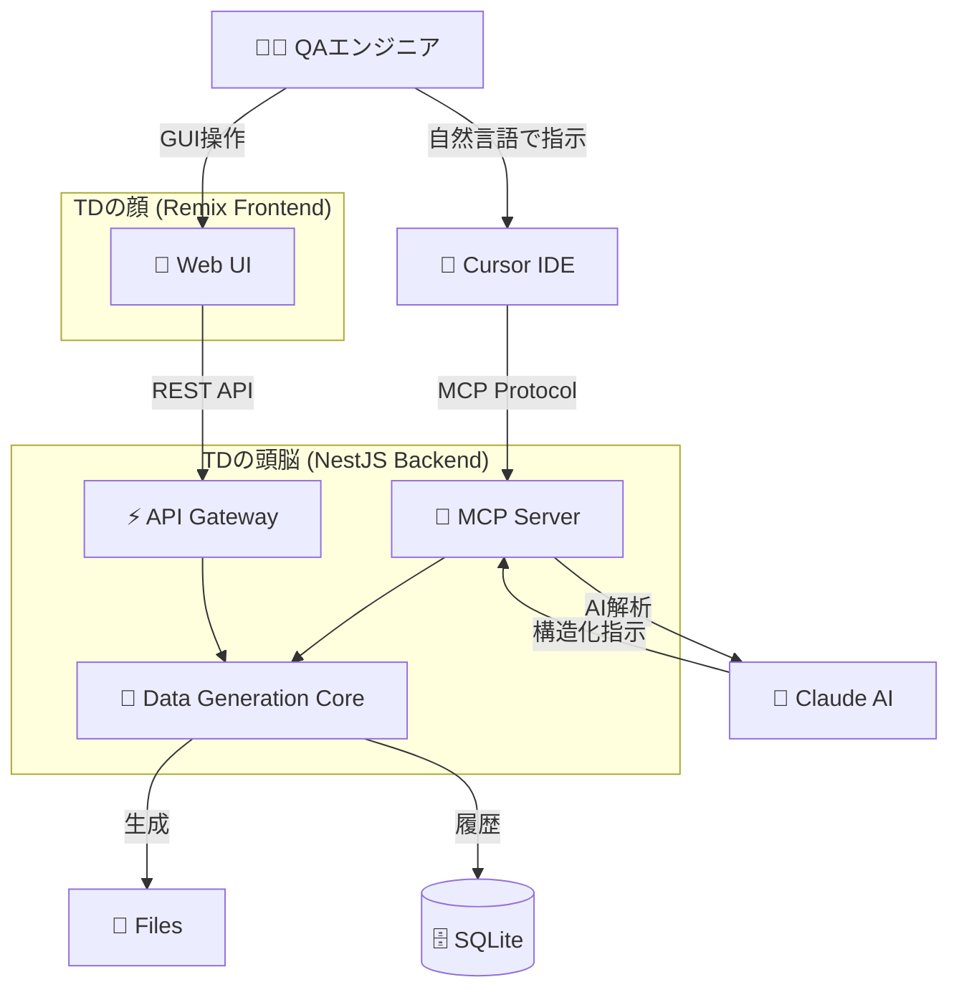

# 🤖 TestData Buddy (TD)

**QAエンジニアの最高の相棒、TDがテストデータ生成をお手伝い！**

<div align="center">

```
    /\_/\  
   ( o.o ) 
    > ^ <  TD
  ┌─────────┐
  │ データ  │
  │ 生成中… │
  └─────────┘
```

[](https://opensource.org/licenses/MIT)
[](https://nodejs.org/)
[](https://www.typescriptlang.org/)
[](https://www.anthropic.com/claude)

</div>

## 🎯 TDとは？

**TestData Buddy（愛称：TD）** は、QAエンジニアのためのAI連携型テストデータ生成ツールです。TDくんが、面倒なテストデータ作成をサクッと解決してくれます！

### 🤝 TDの性格
- **忠実**: いつでもQAエンジニアの側に寄り添います
- **頼りになる**: どんなテストデータでもお任せください  
- **少しお茶目**: たまに意外なデータを生成して驚かせるかも？

### ✨ TDができること

| 機能 | 説明 | TDからのメッセージ |
|------|------|-------------------|
| 🔐 **パスワード生成** | 強力で安全なパスワードを瞬時に生成 | *「セキュアなパスワード、できました〜！」* |
| 👤 **個人情報生成** | 日本語対応の擬似個人情報を大量生成 | *「山田太郎さんから始まる1000人分、準備完了です！」* |
| 📄 **ファイル生成** | CSV、JSON、XMLなど様々な形式のテストファイル | *「100万行のCSVファイル、メモリ効率よく作りました♪」* |
| 🎨 **テキスト生成** | ひらがな、漢字、旧字体など多様な文字種に対応 | *「旧字体の『學校』もお手の物です！」* |
| 🤖 **AI連携** | 自然言語でデータ生成を指示 | *「『記号入りパスワード5個』って言うだけで、はい完成！」* |
| 🔧 **Cursor統合** | IDE内からシームレスなデータ生成 | *「開発中に必要なデータ、すぐにご用意します！」* |

## 🚀 クイックスタート

### 前提条件
- Node.js 18.0.0以上
- pnpm 8.0.0以上
- Claude API キー（AI機能を使用する場合）

### セットアップ
```bash
# 1. プロジェクトクローン
git clone https://github.com/your-org/td-buddy-app.git
cd td-buddy-app

# 2. 依存関係インストール
pnpm install

# 3. 環境設定
cp .env.example .env
# .envファイルを編集してClaude APIキーを設定

# 4. データベース初期化
pnpm run db:migrate

# 5. 開発サーバー起動
pnpm run dev
```

### 初回起動
```bash
# http://localhost:3000 にアクセス
# TDくんがお出迎えしてくれます！
```

## 📖 使い方

### 基本的な使い方

1. **Web UIで直接操作**
   ```
   ブラウザで http://localhost:3000 を開く
   → 好きな機能を選択
   → パラメータを設定
   → 「生成」ボタンをクリック
   → TDくんがデータを作成！
   ```

2. **自然言語でAI指示**
   ```
   「英数字12文字のパスワードを5個作って」
   「日本の住所を含む個人情報を100件生成して」
   「1万行のテスト用CSVファイルを作成して」
   ```

3. **Cursor IDEから直接利用**
   ```typescript
   // コメントで指示するだけ
   // TD: パスワード生成 16文字 記号含む
   const password = "aB3$dEf7&HiJ9@Kl";
   ```

### API利用例

```typescript
// パスワード生成
const response = await fetch('/api/generate/password', {
  method: 'POST',
  headers: { 'Content-Type': 'application/json' },
  body: JSON.stringify({
    length: 12,
    includeSymbols: true,
    count: 5
  })
});

// 個人情報生成
const personalData = await fetch('/api/generate/personal-info', {
  method: 'POST',
  headers: { 'Content-Type': 'application/json' },
  body: JSON.stringify({
    count: 100,
    fields: ['fullName', 'email', 'address'],
    locale: 'ja'
  })
});
```

## 🏗️ アーキテクチャ



## 📁 プロジェクト構成

```
td-buddy-app/
├── packages/
│   ├── api-server/          # 🧠 TDの頭脳 (NestJS)
│   ├── web-ui/              # 🎨 TDの顔 (Remix)
│   └── shared/              # 🔗 共通コンポーネント
├── docs/                    # 📚 ドキュメント
├── data/                    # 💾 生成データ・DB
└── scripts/                 # 🛠️ 便利スクリプト
```

## 🔧 開発ガイド

### 開発の始め方

```bash
# 開発環境の確認
pnpm run diagnose

# テスト実行
pnpm run test

# コード品質チェック
pnpm run lint

# TDくんと一緒に開発開始！
pnpm run dev
```

### 主要コマンド

| コマンド | 説明 | TDのコメント |
|----------|------|--------------|
| `pnpm run dev` | 開発サーバー起動 | *「開発環境、準備完了です！」* |
| `pnpm run build` | プロダクションビルド | *「最適化して本番用にビルドします」* |
| `pnpm run test` | テスト実行 | *「品質チェック、お任せください」* |
| `pnpm run db:migrate` | データベース初期化 | *「データベースの準備をします」* |
| `pnpm run diagnose` | システム診断 | *「システムの健康状態をチェック中…」* |

## 📊 パフォーマンス

TDくんの処理速度：

- **パスワード生成**: < 100ms ⚡
- **個人情報生成**: < 2秒（1,000件）💨
- **ファイル生成**: < 30秒（100MB）🚀
- **AI処理**: < 3秒 🧠

## 🛡️ セキュリティ

TDくんは安全第一：

- ✅ 生成データは24時間で自動削除
- ✅ APIキーは暗号化保存
- ✅ 入力値の厳格なバリデーション
- ✅ レート制限でDDoS攻撃を防御
- ✅ ローカル環境での完全動作

## 📚 ドキュメント

| ドキュメント | 対象者 | TDからの一言 |
|-------------|--------|-------------|
| [🚀 開発ロードマップ](docs/開発ロードマップ.md) | プロジェクト管理者 | *「計画的に進めましょう！」* |
| [🔧 技術仕様書](docs/技術仕様書.md) | 開発者 | *「技術的な詳細はこちら」* |
| [🏗️ プロジェクト構成](docs/プロジェクト構成.md) | 開発者 | *「迷子にならないように」* |
| [🛡️ セキュリティガイドライン](docs/セキュリティガイドライン.md) | 全員 | *「安全が最優先です」* |
| [⚡ パフォーマンス最適化](docs/パフォーマンス最適化ガイド.md) | 開発者 | *「速さも重要ですね」* |
| [🚨 トラブルシューティング](docs/トラブルシューティングガイド.md) | 全員 | *「困ったときはこちら」* |

## 🤝 コントリビューション

TDくんと一緒にプロジェクトを改善しませんか？

1. このリポジトリをフォーク
2. 機能ブランチを作成: `git checkout -b feature/amazing-feature`
3. 変更をコミット: `git commit -m 'feat: Add amazing feature'`
4. ブランチをプッシュ: `git push origin feature/amazing-feature`
5. Pull Requestを作成

### 開発ルール

- 🧪 新機能には必ずテストを追加
- 📝 コードにはコメントを適切に記載
- 🎨 TypeScriptの型安全性を重視
- 🐛 バグ修正には再現手順を明記

## 📄 ライセンス

このプロジェクトは MIT ライセンスの下で公開されています。詳細は [LICENSE](LICENSE) ファイルをご覧ください。

## 👥 クレジット

### チームメンバー
- **TD（ティーディー）** - メインキャラクター & アイデア提供者
- **開発チーム** - TDの能力を実装する技術者たち

### 使用技術
- **Frontend**: Remix + TypeScript + TailwindCSS
- **Backend**: NestJS + TypeScript + SQLite
- **AI**: Claude API (Anthropic)
- **Development**: pnpm + ESLint + Prettier + Jest

---

<div align="center">

**🤖 「困ったときは、TDにお任せください！」**

*TestData Buddy は QAエンジニアの作業効率化を支援します*

[📖 ドキュメント](docs/) | [🐛 Issue報告](https://github.com/your-org/td-buddy-app/issues) | [💬 ディスカッション](https://github.com/your-org/td-buddy-app/discussions)

</div> 