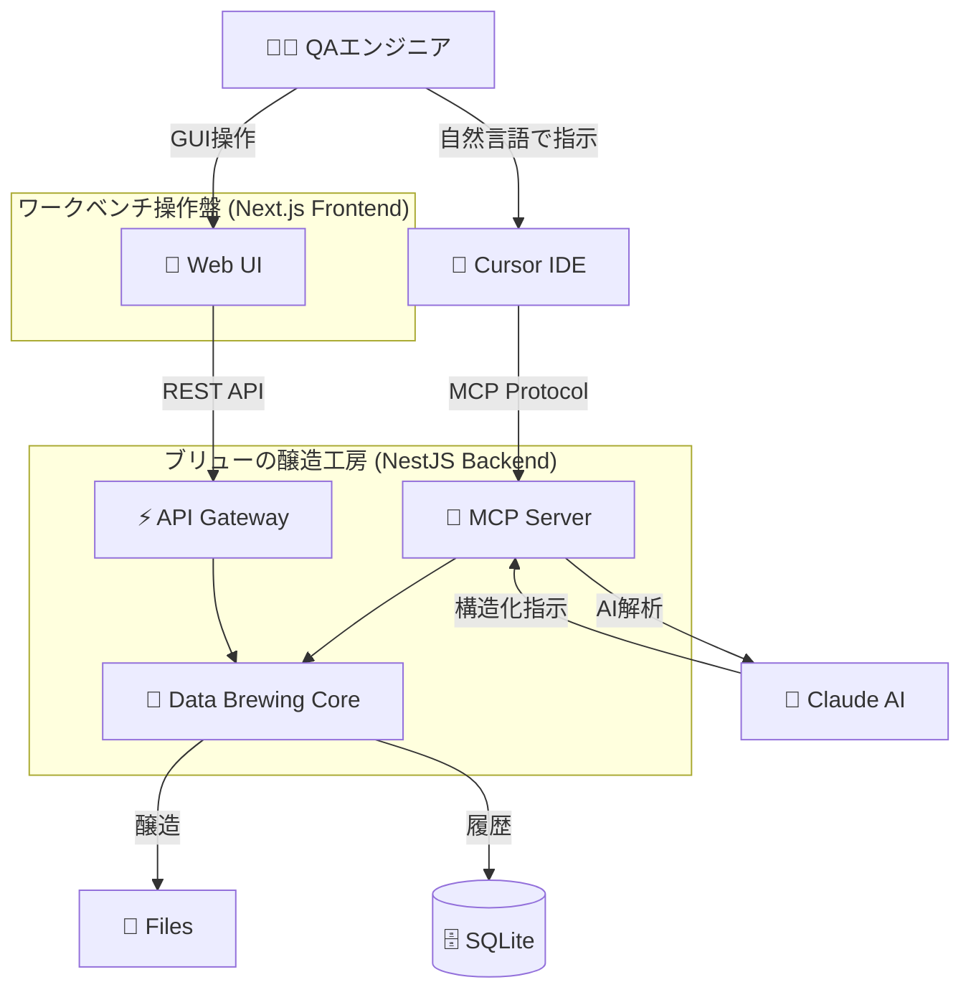
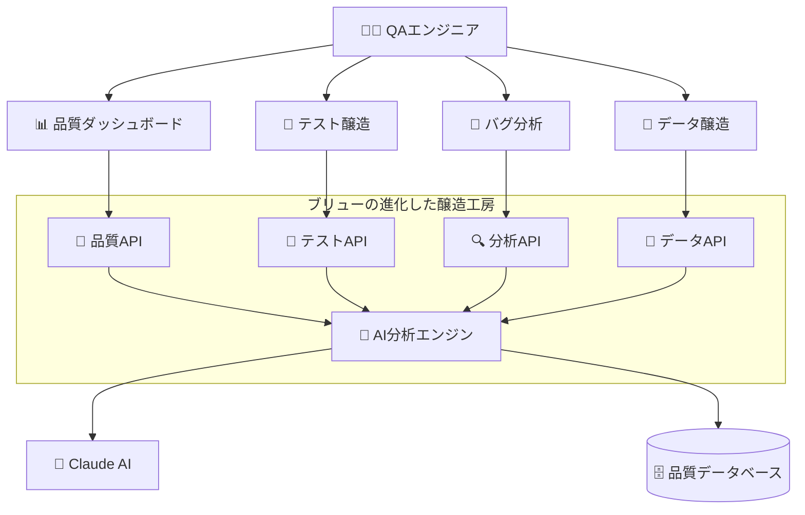

# 🛠️ QA Workbench

**QA エンジニアの専用作業台 - データ醸造から品質管理まで、助手のブリューがサポート**

<div align="center">

```
    /\_/\
   ( ^.^ )
    > ◇ <  Brew
  ┌─────────────┐
  │ データ醸造中 │
  │  お任せを♪  │
  └─────────────┘
```

[](https://opensource.org/licenses/MIT)
[](https://nodejs.org/)
[](https://www.typescriptlang.org/)
[](https://www.anthropic.com/claude)

</div>

## 🎯 QA Workbench とは？

**QA Workbench** は、QA エンジニアの専用作業台です。助手の**ブリュー**が、テストデータの醸造から品質管理まで、あらゆる QA 作業をサポートします。まるで熟練の職人が工房で道具を使うように、QA エンジニアが効率的に品質業務を行える環境を提供します。

### 🍺 ブリューの特徴

**ブリュー（Assistant Brew）** は、QA Workbench で働く頼れる助手です：

- **醸造マスター**: 良質なテストデータを丁寧に醸造します
- **作業補助**: QA エンジニアの作業を効率的にサポート
- **学習型助手**: 使うほどにあなたの好みを覚えて最適化
- **安全第一**: セキュリティと品質を最優先に考慮

### ✨ ブリューの現在の醸造能力

| 機能                  | 説明                                          | ブリューからのメッセージ                                            |
| --------------------- | --------------------------------------------- | ------------------------------------------------------------------- |
| 🔐 **パスワード醸造** | 強力で安全なパスワードを瞬時に醸造            | _「セキュアなパスワード、丁寧に醸造しました〜！」_                  |
| 👤 **個人情報醸造**   | 日本語対応の擬似個人情報を大量醸造            | _「山田太郎さんから始まる 1000 人分、フレッシュに醸造完了です！」_  |
| 📄 **ファイル醸造**   | CSV、JSON、XML など様々な形式のテストファイル | _「100 万行の CSV ファイル、メモリ効率よく醸造いたしました ♪」_     |
| 🎨 **テキスト醸造**   | ひらがな、漢字、旧字体など多様な文字種に対応  | _「旧字体の『學校』も得意です！」_                                  |
| 🤖 **AI 連携醸造**    | 自然言語でデータ醸造を指示                    | _「『記号入りパスワード 5 個醸造して』って言うだけで、はい完成！」_ |
| 🔧 **Cursor 統合**    | IDE 内からシームレスなデータ醸造              | _「開発中に必要なデータ、すぐに醸造してご用意します！」_            |

### 🌟 ブリューの今後の進化予定

| Phase        | 機能領域                | 主要機能                                                        | 提供開始予定 |
| ------------ | ----------------------- | --------------------------------------------------------------- | ------------ |
| **Phase 2A** | 🎯 **コア QA 機能**     | テストケース醸造・バグ分析・品質メトリクス基盤                  | 3-4 ヶ月後   |
| **Phase 2B** | 🔄 **自動化支援**       | API テスト支援・テスト自動化・品質ダッシュボード                | 4-6 ヶ月後   |
| **Phase 3**  | 🚀 **高度品質機能**     | セキュリティテスト・パフォーマンステスト・AI 品質コンサルタント | 6-12 ヶ月後  |
| **Phase 4**  | 🏢 **エンタープライズ** | チーム機能・ワークフロー統合・高度レポート分析                  | 12-18 ヶ月後 |

**ブリューからのメッセージ**: _「現在のテストデータ醸造は私の基本能力です。でも私の真の目標は、QA エンジニアの皆さんの品質保証業務全体をサポートすることなんです！一緒に、もっと効率的で楽しい品質管理を実現していきましょう ♪」_

## 🚀 クイックスタート

### 前提条件

- Node.js 18.0.0 以上
- pnpm 8.0.0 以上
- Claude API キー（AI 機能を使用する場合）

### セットアップ

```bash
# 1. プロジェクトクローン
git clone https://github.com/your-org/qa-workbench.git
cd qa-workbench

# 2. 依存関係インストール
pnpm install

# 3. 環境設定
cp .env.example .env
# .envファイルを編集してClaude APIキーを設定

# 4. データベース初期化
pnpm run db:migrate

# 5. 開発サーバー起動
cd td-buddy-webapp
npm run dev
```

### 初回起動

```bash
# http://localhost:3000 にアクセス
# ブリューがお出迎えしてくれます！
```

## 📖 使い方

### 基本的な使い方

1. **Web UI で直接操作**

   ```
   ブラウザで http://localhost:3000 を開く
   → 好きな機能を選択
   → パラメータを設定
   → 「醸造」ボタンをクリック
   → ブリューがデータを醸造！
   ```

2. **自然言語で AI 指示**

   ```
   「英数字12文字のパスワードを5個醸造して」
   「日本の住所を含む個人情報を100件醸造して」
   「1万行のテスト用CSVファイルを醸造して」
   ```

3. **Cursor IDE から直接利用**
   ```typescript
   // コメントで指示するだけ
   // Brew: パスワード醸造 16文字 記号含む
   const password = "aB3$dEf7&HiJ9@Kl";
   ```

### API 利用例

```typescript
// パスワード醸造
const response = await fetch("/api/generate/password", {
  method: "POST",
  headers: { "Content-Type": "application/json" },
  body: JSON.stringify({
    length: 12,
    includeSymbols: true,
    count: 5,
  }),
});

// 個人情報醸造
const personalData = await fetch("/api/generate/personal-info", {
  method: "POST",
  headers: { "Content-Type": "application/json" },
  body: JSON.stringify({
    count: 100,
    fields: ["fullName", "email", "address"],
    locale: "ja",
  }),
});
```

## 🏗️ アーキテクチャ

### 現在のアーキテクチャ（Phase 1: データ醸造基盤）



### 目標アーキテクチャ（Phase 2-4: 品質保証統合ワークベンチ）



## 📁 プロジェクト構成

```
qa-workbench/
├── td-buddy-webapp/         # 🎨 メインWebアプリケーション（移行中）
│   ├── frontend/            # Next.js フロントエンド
│   └── backend/             # NestJS バックエンド
├── docs/                    # 📚 ドキュメント
├── data/                    # 💾 生成データ・DB
├── src/                     # 🧠 コアロジック・スクリプト
└── tests/                   # 🧪 テストファイル
```

## 🔧 開発ガイド

### 開発の始め方

```bash
# 開発環境の確認
cd td-buddy-webapp && npm run diagnose

# テスト実行
cd td-buddy-webapp && npm run test

# コード品質チェック
cd td-buddy-webapp && npm run lint

# ブリューと一緒に開発開始！
cd td-buddy-webapp && npm run dev
```

### 主要コマンド

| コマンド                              | 説明                 | ブリューのコメント                  |
| ------------------------------------- | -------------------- | ----------------------------------- |
| `cd td-buddy-webapp && npm run dev`   | 開発サーバー起動     | _「ワークベンチの準備完了です！」_  |
| `cd td-buddy-webapp && npm run build` | プロダクションビルド | _「最適化して本番用に醸造します」_  |
| `cd td-buddy-webapp && npm run test`  | テスト実行           | _「品質チェック、お任せください」_  |
| `npm run db:migrate`                  | データベース初期化   | _「データベースの準備をします」_    |
| `cd td-buddy-webapp && npm run lint`  | コード品質チェック   | _「コードの健康状態をチェック中…」_ |

## 📊 パフォーマンス

ブリューの醸造速度：

- **パスワード醸造**: < 100ms ⚡
- **個人情報醸造**: < 2 秒（1,000 件）💨
- **ファイル醸造**: < 30 秒（100MB）🚀
- **AI 処理**: < 3 秒 🧠

## 🛡️ セキュリティ

ブリューは安全第一：

- ✅ 醸造データは 24 時間で自動削除
- ✅ API キーは暗号化保存
- ✅ 入力値の厳格なバリデーション
- ✅ レート制限で DDoS 攻撃を防御
- ✅ ローカル環境での完全動作

## 📚 ドキュメント

| ドキュメント                                                                  | 対象者             | ブリューからの一言                     |
| ----------------------------------------------------------------------------- | ------------------ | -------------------------------------- |
| [🚀 QA Workbench 拡張計画](docs/quality-buddy-expansion-overview-restored.md) | プロジェクト管理者 | _「将来のビジョンをご確認ください！」_ |
| [🔧 技術仕様書](docs/技術仕様書.md)                                           | 開発者             | _「技術的な詳細はこちら」_             |
| [🏗️ プロジェクト構成](docs/プロジェクト構成.md)                               | 開発者             | _「迷子にならないように」_             |
| [🛡️ セキュリティガイドライン](docs/セキュリティガイドライン.md)               | 全員               | _「安全が最優先です」_                 |
| [⚡ パフォーマンス最適化](docs/パフォーマンス最適化ガイド.md)                 | 開発者             | _「速さも重要ですね」_                 |
| [🚨 トラブルシューティング](docs/トラブルシューティングガイド.md)             | 全員               | _「困ったときはこちら」_               |

## 🗺️ ロードマップ

### 🎯 品質保証統合ワークベンチへの進化

**Phase 1: 基盤強化**（✅ 完了済み）

- テストデータ醸造機能
- 基本的な AI 連携
- ワークベンチ UI 基盤

**Phase 2A: コア QA 機能**（🎯 3-4 ヶ月）

- テストケース生成・管理
- バグ分析・分類支援
- 品質メトリクス基盤

**Phase 2B: 自動化支援**（🔄 4-6 ヶ月）

- API テスト支援
- テスト自動化ツール連携
- リアルタイム品質ダッシュボード

**Phase 3: 高度品質機能**（🚀 6-12 ヶ月）

- セキュリティテスト支援
- パフォーマンステスト分析
- AI 品質コンサルタント機能

**Phase 4: エンタープライズ対応**（🏢 12-18 ヶ月）

- チーム・組織機能
- ワークフロー統合
- 高度レポート・分析機能

## 🤝 コントリビューション

ブリューと一緒にプロジェクトを改善しませんか？

1. このリポジトリをフォーク
2. 機能ブランチを作成: `git checkout -b feature/amazing-feature`
3. 変更をコミット: `git commit -m 'feat: Add amazing feature'`
4. ブランチをプッシュ: `git push origin feature/amazing-feature`
5. Pull Request を作成

### 開発ルール

- 🧪 新機能には必ずテストを追加
- 📝 コードにはコメントを適切に記載
- 🎨 TypeScript の型安全性を重視
- 🐛 バグ修正には再現手順を明記

## 📄 ライセンス

このプロジェクトは MIT ライセンスの下で公開されています。詳細は [LICENSE](LICENSE) ファイルをご覧ください。

## 👥 クレジット

### チームメンバー

- **ブリュー（Brew）** - QA Workbench 助手 & データ醸造マスター
- **開発チーム** - ブリューの能力を実装する技術者たち

### 使用技術

- **Frontend**: Next.js + TypeScript + TailwindCSS
- **Backend**: NestJS + TypeScript + SQLite
- **AI**: Claude API (Anthropic)
- **Development**: npm + ESLint + Prettier + Jest

---

<div align="center">

**🛠️ 「QA 作業のことなら、ブリューにお任せください！」**

_QA Workbench は QA エンジニアの専用作業台です_

[📖 ドキュメント](docs/) | [🐛 Issue 報告](https://github.com/your-org/qa-workbench/issues) | [💬 ディスカッション](https://github.com/your-org/qa-workbench/discussions)

</div>
