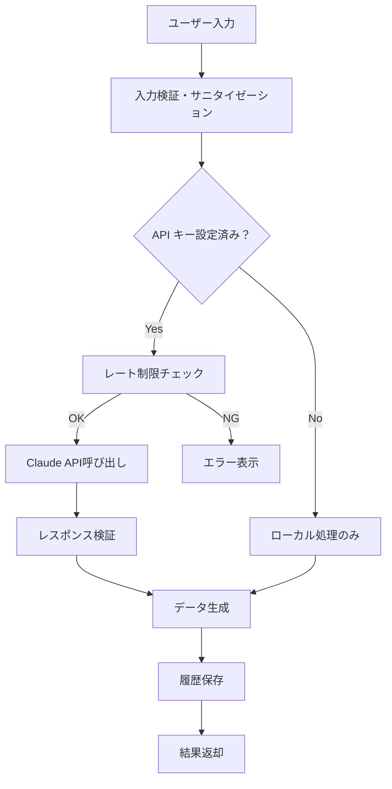
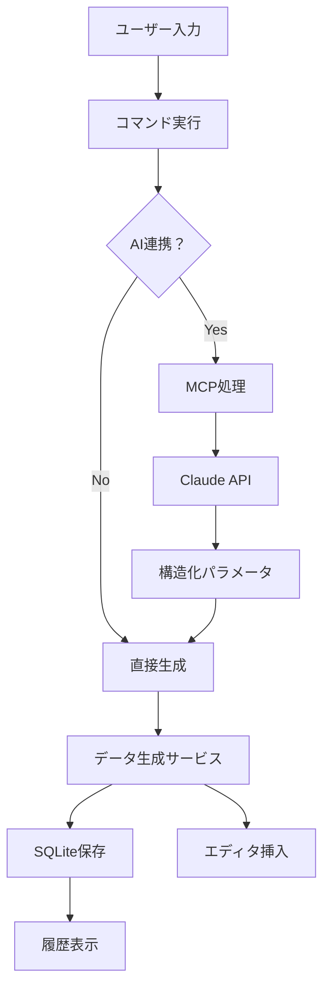

# TestData Buddy VSCode/Cursor拡張機能 プロジェクト構造

TestData Buddyは、開発者・QAエンジニア向けのAI連携型テストデータ生成VSCode/Cursor拡張機能です。

## ディレクトリ構成

```
td-buddy-app/
├── src/                        # 拡張機能ソースコード
│   ├── extension.ts            # 拡張機能エントリーポイント
│   ├── commands/               # コマンド実装
│   │   ├── generate/           # データ生成コマンド
│   │   │   ├── password.ts     # パスワード生成
│   │   │   ├── personal-info.ts # 個人情報生成
│   │   │   ├── file-data.ts    # ファイルデータ生成
│   │   │   └── random-text.ts  # ランダムテキスト生成
│   │   ├── ui/                 # UI関連コマンド
│   │   │   ├── sidebar.ts      # サイドバー表示
│   │   │   └── quick-pick.ts   # クイックピック実装
│   │   └── ai/                 # AI連携コマンド
│   │       ├── mcp-client.ts   # MCPクライアント
│   │       └── claude-api.ts   # Claude API連携
│   │
│   ├── services/               # ビジネスロジック
│   │   ├── generators/         # データ生成サービス
│   │   │   ├── password.service.ts
│   │   │   ├── personal-info.service.ts
│   │   │   ├── file.service.ts
│   │   │   ├── random-text.service.ts
│   │   │   └── kanji.service.ts
│   │   ├── storage/            # データ永続化
│   │   │   ├── sqlite.service.ts
│   │   │   └── settings.service.ts
│   │   └── ai/                 # AI連携サービス
│   │       ├── mcp.service.ts
│   │       └── claude.service.ts
│   │
│   ├── ui/                     # UI コンポーネント
│   │   ├── webview/            # Webviewパネル
│   │   │   ├── src/            # React/Vue フロントエンド
│   │   │   │   ├── components/
│   │   │   │   ├── pages/
│   │   │   │   ├── store/
│   │   │   │   └── utils/
│   │   │   ├── public/
│   │   │   └── index.html
│   │   ├── tree-view/          # ツリービュープロバイダー
│   │   │   └── history-provider.ts
│   │   └── status-bar/         # ステータスバー
│   │       └── status-provider.ts
│   │
│   ├── types/                  # TypeScript型定義
│   │   ├── generator.types.ts
│   │   ├── ai.types.ts
│   │   └── ui.types.ts
│   │
│   ├── utils/                  # ユーティリティ
│   │   ├── validation.ts
│   │   ├── format.ts
│   │   └── logger.ts
│   │
│   └── constants/              # 定数定義
│       ├── commands.ts
│       ├── messages.ts
│       └── defaults.ts
│
├── resources/                  # リソースファイル
│   ├── icons/                  # アイコン
│   │   ├── light/
│   │   └── dark/
│   ├── snippets/               # コードスニペット
│   │   └── testdata.json
│   └── templates/              # テンプレートファイル
│       ├── csv/
│       ├── json/
│       └── xml/
│
├── data/                       # データファイル
│   ├── database/               # SQLiteファイル
│   │   └── testdata.db
│   ├── kanji/                  # 漢字データ
│   │   ├── jlpt-n1.json
│   │   ├── jlpt-n2.json
│   │   └── common.json
│   └── templates/              # データテンプレート
│       ├── names.json
│       ├── addresses.json
│       └── companies.json
│
├── tests/                      # テストコード
│   ├── unit/                   # ユニットテスト
│   │   ├── services/
│   │   └── commands/
│   ├── integration/            # 統合テスト
│   └── fixtures/               # テストデータ
│
├── docs/                       # ドキュメント
│   ├── development/            # 開発者向け
│   ├── user/                   # ユーザー向け
│   └── api/                    # API仕様
│
├── scripts/                    # スクリプト
│   ├── build.js               # ビルドスクリプト
│   ├── package.js             # パッケージングスクリプト
│   └── release.js             # リリーススクリプト
│
├── package.json               # VSCode拡張機能マニフェスト
├── tsconfig.json              # TypeScript設定
├── webpack.config.js          # Webpack設定
├── .vscodeignore             # VSCode拡張機能パッケージ除外設定
├── README.md                  # 拡張機能説明
├── CHANGELOG.md               # 変更履歴
└── LICENSE                    # ライセンス
```

## package.json 設定例

```json
{
  "name": "testdata-buddy",
  "displayName": "TestData Buddy",
  "description": "AI連携型テストデータ生成ツール",
  "version": "1.0.0",
  "publisher": "testdata-buddy",
  "engines": {
    "vscode": "^1.74.0"
  },
  "categories": [
    "Other",
    "Testing",
    "Data Science"
  ],
  "activationEvents": [],
  "main": "./out/extension.js",
  "contributes": {
    "commands": [
      {
        "command": "testdata-buddy.generate.password",
        "title": "パスワード生成",
        "category": "TestData Buddy",
        "icon": "$(key)"
      },
      {
        "command": "testdata-buddy.generate.personalInfo",
        "title": "個人情報生成",
        "category": "TestData Buddy",
        "icon": "$(person)"
      },
      {
        "command": "testdata-buddy.generate.file",
        "title": "ファイル生成",
        "category": "TestData Buddy",
        "icon": "$(file)"
      },
      {
        "command": "testdata-buddy.ai.naturalLanguage",
        "title": "自然言語でデータ生成",
        "category": "TestData Buddy",
        "icon": "$(robot)"
      },
      {
        "command": "testdata-buddy.openPanel",
        "title": "パネルを開く",
        "category": "TestData Buddy",
        "icon": "$(window)"
      }
    ],
    "viewsContainers": {
      "activitybar": [
        {
          "id": "testdata-buddy",
          "title": "TestData Buddy",
          "icon": "$(database)"
        }
      ]
    },
    "views": {
      "testdata-buddy": [
        {
          "id": "testdata-buddy-history",
          "name": "生成履歴",
          "when": "true"
        },
        {
          "id": "testdata-buddy-quick-actions",
          "name": "クイックアクション",
          "when": "true"
        }
      ]
    },
    "menus": {
      "view/title": [
        {
          "command": "testdata-buddy.openPanel",
          "when": "view == testdata-buddy-history",
          "group": "navigation"
        }
      ],
      "commandPalette": [
        {
          "command": "testdata-buddy.generate.password",
          "when": "true"
        },
        {
          "command": "testdata-buddy.generate.personalInfo", 
          "when": "true"
        },
        {
          "command": "testdata-buddy.generate.file",
          "when": "true"
        },
        {
          "command": "testdata-buddy.ai.naturalLanguage",
          "when": "true"
        }
      ]
    },
    "configuration": {
      "title": "TestData Buddy",
      "properties": {
        "testdata-buddy.ai.apiKey": {
          "type": "string",
          "description": "Claude API キー（MCP機能用）",
          "scope": "application"
        },
        "testdata-buddy.ai.model": {
          "type": "string",
          "default": "claude-3-sonnet-20240229",
          "enum": [
            "claude-3-sonnet-20240229",
            "claude-3-haiku-20240307"
          ],
          "description": "使用するClaude AIモデル"
        },
        "testdata-buddy.generation.locale": {
          "type": "string",
          "default": "ja",
          "enum": ["ja", "en"],
          "description": "データ生成ロケール"
        },
        "testdata-buddy.generation.defaultPasswordLength": {
          "type": "number",
          "default": 12,
          "minimum": 4,
          "maximum": 128,
          "description": "デフォルトパスワード長"
        },
        "testdata-buddy.storage.maxHistoryItems": {
          "type": "number",
          "default": 100,
          "minimum": 10,
          "maximum": 1000,
          "description": "保存する履歴の最大数"
        },
        "testdata-buddy.security.enableApiTimeout": {
          "type": "boolean",
          "default": true,
          "description": "API呼び出しタイムアウトを有効にする"
        },
        "testdata-buddy.security.maxPromptLength": {
          "type": "number",
          "default": 1000,
          "minimum": 100,
          "maximum": 5000,
          "description": "プロンプトの最大文字数"
        }
      }
    },
    "keybindings": [
      {
        "command": "testdata-buddy.generate.password",
        "key": "ctrl+alt+p",
        "mac": "cmd+alt+p"
      },
      {
        "command": "testdata-buddy.ai.naturalLanguage",
        "key": "ctrl+alt+g",
        "mac": "cmd+alt+g"
      }
    ],
    "snippets": [
      {
        "language": "javascript",
        "path": "./resources/snippets/testdata.json"
      },
      {
        "language": "typescript",
        "path": "./resources/snippets/testdata.json"
      }
    ]
  }
}
```

## 命名規則

### ファイル・ディレクトリ
- **ディレクトリ**: kebab-case (`password-generator`)
- **ファイル**: kebab-case (`password.service.ts`)
- **コンポーネント**: PascalCase (`PasswordGenerator.tsx`)

### コード
- **変数・関数**: camelCase (`generatePassword`)
- **定数**: UPPER_SNAKE_CASE (`MAX_PASSWORD_LENGTH`)
- **型・インターフェース**: PascalCase (`PasswordConfig`)
- **enum**: PascalCase (`FileFormat`)
- **コマンドID**: kebab-case (`testdata-buddy.generate.password`)

## 拡張機能アーキテクチャ

### セキュリティ設計


### データフロー


### 拡張機能ライフサイクル
1. **Activation**: 初回コマンド実行時
2. **Registration**: コマンド・プロバイダー登録
3. **Service Initialization**: サービス初期化
4. **Database Setup**: SQLite DB初期化
5. **Ready**: ユーザー操作待機

## Git ブランチ戦略

### ブランチ命名
- `main`: 本番ブランチ（VSCode Marketplace公開版）
- `develop`: 開発ブランチ
- `feature/機能名`: 機能開発ブランチ
- `bugfix/修正内容`: バグ修正ブランチ
- `release/vX.X.X`: リリース準備ブランチ

### コミットメッセージ
```
type(scope): 変更内容

feat(password): パスワード強度計算機能を追加
fix(ui): Webviewパネルの表示エラー修正
docs(readme): インストール手順を更新
```

## 開発環境セットアップ

### 必要なツール
- Node.js 18+
- npm または pnpm
- VSCode または Cursor
- VSCode Extension Development Host

### 開発開始コマンド
```bash
npm install
npm run compile
# F5キーでExtension Development Hostを起動
``` 