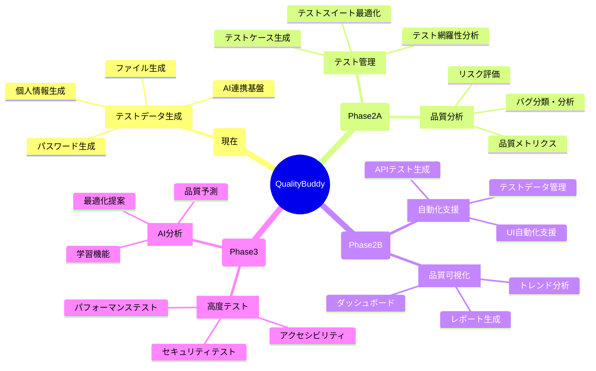

# 🗺️ QualityBuddy 機能別ロードマップ

## 📋 機能マップ全体像



## 🎯 Phase 2A: コア QA 機能（3-4 ヶ月）

### 🧪 1. テストケース生成・管理

#### **1.1 要件からテストケース自動生成**

```typescript
interface RequirementAnalyzer {
  // 自然言語の要件からテストケースを生成
  generateTestCases(requirement: string): TestCase[];

  // テストケースの種類
  // - 正常系テスト
  // - 異常系テスト
  // - 境界値テスト
  // - セキュリティテスト
}

// 実装例
const requirement = "ユーザーはパスワードを8-20文字で設定できる";
const testCases = await qb.generateTestCases(requirement);
/*
[
  { type: '正常系', input: '12345678', expected: '成功' },
  { type: '境界値', input: '1234567', expected: '失敗（短すぎ）' },
  { type: '境界値', input: '12345678901234567890', expected: '成功' },
  { type: '異常系', input: '123456789012345678901', expected: '失敗（長すぎ）' }
]
*/
```

**技術実装**:

- Claude AI による要件文書解析
- テストパターンテンプレートマッチング
- 境界値分析アルゴリズム

**UI 機能**:

- 要件入力フォーム
- 生成されたテストケースの表示・編集
- Excel/CSV 形式でのエクスポート

#### **1.2 テスト網羅性分析**

```typescript
interface CoverageAnalyzer {
  analyzeCoverage(
    testCases: TestCase[],
    requirements: Requirement[]
  ): CoverageReport;
  findGaps(coverage: CoverageReport): Gap[];
  suggestAdditionalTests(gaps: Gap[]): TestCase[];
}

// カバレッジタイプ
type CoverageType =
  | "requirement_coverage" // 要件カバレッジ
  | "boundary_coverage" // 境界値カバレッジ
  | "error_condition_coverage" // エラー条件カバレッジ
  | "security_coverage"; // セキュリティカバレッジ
```

#### **1.3 テストスイート最適化**

```typescript
interface TestSuiteOptimizer {
  // 重複テストケースの検出
  findDuplicates(testCases: TestCase[]): DuplicateGroup[];

  // テスト実行優先度の決定
  prioritizeTests(
    testCases: TestCase[],
    criteria: PriorityCriteria
  ): TestCase[];

  // テスト実行時間の最適化
  optimizeExecutionOrder(testCases: TestCase[]): ExecutionPlan;
}
```

### 🐛 2. バグ分析・分類支援

#### **2.1 バグレポート自動分類**

```typescript
interface BugClassifier {
  classifyBug(bugReport: BugReport): BugClassification;
  extractKeyInfo(bugReport: string): BugInfo;
  suggestSimilarBugs(currentBug: Bug): Bug[];
}

interface BugClassification {
  severity: "Critical" | "High" | "Medium" | "Low";
  category: "UI" | "Logic" | "Performance" | "Security" | "Integration";
  priority: number; // 1-5
  estimatedEffort: number; // 工数（時間）
  suggestedAssignee?: string;
}
```

**実装機能**:

- 自然言語でのバグ報告 → 構造化データ変換
- 過去のバグデータベースからの類似バグ検索
- 修正優先度の自動算出
- 修正工数の見積もり

#### **2.2 バグトレンド分析**

```typescript
interface BugTrendAnalyzer {
  analyzeTrend(bugs: Bug[], timeRange: TimeRange): TrendReport;
  predictBugCount(historical: Bug[], futureDate: Date): Prediction;
  identifyHotspots(bugs: Bug[]): Hotspot[];
}

interface TrendReport {
  totalBugs: number;
  newBugs: number;
  resolvedBugs: number;
  trend: "improving" | "stable" | "degrading";
  categoryBreakdown: CategoryCount[];
  recommendations: string[];
}
```

### 📊 3. 品質メトリクス・監視

#### **3.1 品質ダッシュボード基盤**

```typescript
interface QualityDashboard {
  // リアルタイム品質状況
  getCurrentQualityStatus(): QualityStatus;

  // 品質トレンド
  getQualityTrend(period: TimePeriod): QualityTrend;

  // アラート・通知
  getQualityAlerts(): QualityAlert[];
}

interface QualityStatus {
  overallScore: number; // 0-100
  testCoverage: number; // パーセンテージ
  bugCount: BugCount;
  riskLevel: "LOW" | "MEDIUM" | "HIGH";
  lastUpdated: Date;
}
```

#### **3.2 品質メトリクス計算**

```typescript
interface QualityMetrics {
  // 基本メトリクス
  calculateDefectDensity(bugs: Bug[], codeSize: number): number;
  calculateTestCoverage(tests: Test[], code: CodeBase): number;
  calculateMTTR(bugs: Bug[]): number; // Mean Time To Resolution

  // 高度メトリクス
  calculateQualityScore(metrics: BaseMetrics): number;
  predictQuality(historical: Metrics[], timeline: Date[]): QualityPrediction;
}
```

## 🔄 Phase 2B: 自動化支援（4-6 ヶ月）

### 🌐 1. API テスト支援

#### **1.1 API テストケース生成**

```typescript
interface APITestGenerator {
  // OpenAPI仕様からテストケース生成
  generateFromOpenAPI(spec: OpenAPISpec): APITestCase[];

  // 実際のAPIコールからテストケース抽出
  generateFromTraffic(apiCalls: APICall[]): APITestCase[];

  // 異常系テストケース生成
  generateErrorTests(endpoint: APIEndpoint): ErrorTestCase[];
}

interface APITestCase {
  method: "GET" | "POST" | "PUT" | "DELETE";
  endpoint: string;
  headers: Record<string, string>;
  body?: any;
  expectedStatus: number;
  expectedResponse?: any;
  assertions: Assertion[];
}
```

#### **1.2 API 負荷テスト**

```typescript
interface LoadTestGenerator {
  // 負荷テストシナリオ生成
  generateLoadTest(config: LoadTestConfig): LoadTestScript;

  // パフォーマンス閾値設定
  setPerformanceThresholds(thresholds: PerformanceThreshold[]): void;

  // 結果分析
  analyzeLoadTestResults(results: LoadTestResult): PerformanceReport;
}
```

### 🤖 2. UI 自動化支援

#### **2.1 自動化スクリプト生成**

```typescript
interface UIAutomationGenerator {
  // ユーザー操作記録からスクリプト生成
  generateFromUserActions(actions: UserAction[]): AutomationScript;

  // スクリーンショットからUI要素抽出
  extractUIElements(screenshot: Buffer): UIElement[];

  // 各種ツール用スクリプト生成
  generateSeleniumScript(scenario: TestScenario): string;
  generatePlaywrightScript(scenario: TestScenario): string;
  generateCypressScript(scenario: TestScenario): string;
}
```

#### **2.2 ページオブジェクト生成**

```typescript
interface PageObjectGenerator {
  // HTMLから自動的にページオブジェクト生成
  generatePageObject(
    html: string,
    framework: "selenium" | "playwright"
  ): string;

  // UI要素の安定性分析
  analyzeElementStability(elements: UIElement[]): StabilityReport;

  // メンテナブルなセレクター提案
  suggestSelectors(element: UIElement): SelectorSuggestion[];
}
```

### 📈 3. 品質可視化・レポート

#### **3.1 動的ダッシュボード**

```typescript
interface DynamicDashboard {
  // カスタマイズ可能ウィジェット
  createWidget(type: WidgetType, config: WidgetConfig): Widget;

  // リアルタイムデータ更新
  subscribeToRealTimeUpdates(metrics: MetricType[]): Observable<MetricUpdate>;

  // ダッシュボード共有
  shareDashboard(dashboard: Dashboard, permissions: Permission[]): ShareLink;
}
```

#### **3.2 品質レポート自動生成**

```typescript
interface ReportGenerator {
  // 各種形式での品質レポート生成
  generateQualityReport(
    data: QualityData,
    template: ReportTemplate,
    format: "PDF" | "HTML" | "Excel"
  ): Report;

  // ステークホルダー別レポート
  generateExecutiveReport(data: QualityData): ExecutiveReport;
  generateTechnicalReport(data: QualityData): TechnicalReport;
  generateProjectReport(data: QualityData): ProjectReport;
}
```

## 🚀 Phase 3: 高度機能（6-12 ヶ月）

### 🔒 1. セキュリティテスト支援

#### **1.1 セキュリティテストケース生成**

```typescript
interface SecurityTestGenerator {
  // OWASP Top 10 対応テスト生成
  generateOWASPTests(target: Target): SecurityTestCase[];

  // 認証・認可テスト
  generateAuthTests(authConfig: AuthConfig): AuthTestCase[];

  // 入力検証テスト
  generateInputValidationTests(inputs: InputField[]): ValidationTestCase[];
}
```

#### **1.2 脆弱性スキャン統合**

```typescript
interface VulnerabilityScanner {
  // 外部ツール統合
  integrateBurpSuite(scanResult: BurpResult): VulnerabilityReport;
  integrateOWASPZAP(scanResult: ZAPResult): VulnerabilityReport;

  // 脆弱性分析
  analyzeVulnerabilities(
    vulnerabilities: Vulnerability[]
  ): VulnerabilityAnalysis;

  // 修正提案
  suggestFixes(vulnerability: Vulnerability): Fix[];
}
```

### ⚡ 2. パフォーマンステスト

#### **2.1 パフォーマンステストシナリオ**

```typescript
interface PerformanceTestGenerator {
  // 負荷パターン生成
  generateLoadPatterns(userStory: UserStory): LoadPattern[];

  // JMeter/k6 スクリプト生成
  generateJMeterScript(scenario: LoadTestScenario): string;
  generateK6Script(scenario: LoadTestScenario): string;

  // パフォーマンス分析
  analyzePerformanceResults(results: PerformanceResult[]): PerformanceAnalysis;
}
```

### 🤖 3. AI 品質コンサルタント

#### **3.1 品質予測・最適化**

```typescript
interface QualityAI {
  // 品質リスク予測
  predictQualityRisks(
    projectData: ProjectData,
    historicalData: HistoricalData
  ): RiskPrediction[];

  // 最適化提案
  suggestOptimizations(currentState: QualityState): Optimization[];

  // 品質戦略提案
  suggestQualityStrategy(
    projectType: ProjectType,
    constraints: Constraint[]
  ): QualityStrategy;
}
```

## 📊 機能実装優先度マトリクス

| 機能                  | 実装難易度 | ユーザー価値 | 優先度  | 実装時期 |
| --------------------- | ---------- | ------------ | ------- | -------- |
| テストケース生成      | 中         | 高           | 🔴 最高 | Phase 2A |
| バグ分析・分類        | 低         | 高           | 🔴 最高 | Phase 2A |
| 品質メトリクス        | 中         | 中           | 🟡 高   | Phase 2A |
| API テスト支援        | 中         | 高           | 🟡 高   | Phase 2B |
| UI 自動化支援         | 高         | 中           | 🟡 高   | Phase 2B |
| ダッシュボード        | 中         | 中           | 🟡 高   | Phase 2B |
| セキュリティテスト    | 高         | 中           | 🟢 中   | Phase 3  |
| パフォーマンステスト  | 高         | 中           | 🟢 中   | Phase 3  |
| AI 品質コンサルタント | 高         | 高           | 🟢 中   | Phase 3  |

## 🎯 成功指標

### Phase 2A 成功指標

- テストケース生成精度: 80%以上
- バグ分類精度: 85%以上
- ユーザー満足度: 4.0/5.0 以上

### Phase 2B 成功指標

- API テスト自動化率: 70%以上
- ダッシュボード利用率: 60%以上
- テスト効率改善: 30%以上

### Phase 3 成功指標

- セキュリティ問題検出率: 90%以上
- パフォーマンス問題予測精度: 75%以上
- AI 提案採用率: 50%以上

---

## 🤖 QB からの実装メッセージ

```
「段階的に機能を拡張していくことで、
 皆さんの品質業務をより強力にサポートできます！

 まずはPhase 2Aから始めて、確実に価値を
 お届けしていきますね♪」
```

---

## 📅 復元情報

- **復元日**: 2025 年 6 月 11 日
- **元ファイル**: `docs/quality-buddy-feature-roadmap.md`
- **削除日**: 2025 年 6 月 11 日 18:31 (セキュリティ機密ドキュメント削除時)
- **復元理由**: プロジェクト計画の継続性確保

**TD からのメッセージ**: 「大切なロードマップを復元できて良かったです！これで開発の方向性が明確になりますね ♪」
