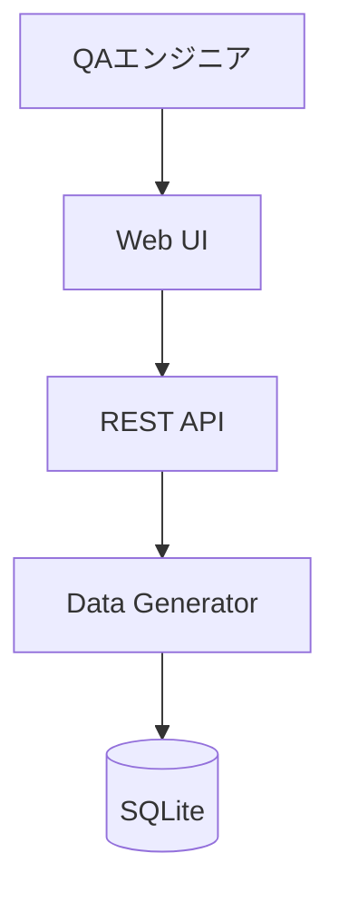
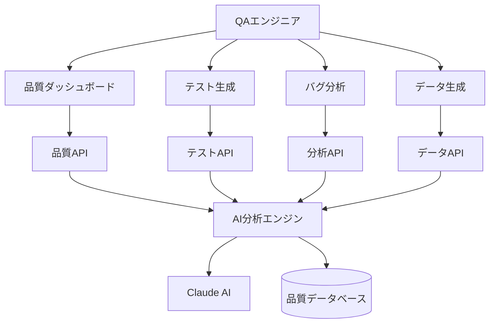

# 🎯 QualityBuddy（QB）品質業務拡張計画 - 全体概要

## 📋 エグゼクティブサマリー

### プロジェクト概要

QualityBuddy（QB）は、現在のテストデータ生成機能を核として、QA エンジニアの品質保証業務全般をサポートする統合プラットフォームへと進化します。

### ビジョン

**「QA エンジニアの万能パートナー - テストデータ生成から品質保証のフルサイクルまで」**

### 戦略的価値

- 🎯 **市場ポジション**: テストデータ生成ツール → 品質保証統合プラットフォーム
- 📈 **拡張性**: 段階的機能追加による安定成長
- 🤖 **AI 差別化**: Claude AI 統合による知的支援
- 👥 **ターゲット拡大**: 個人 QA → QA チーム → 品質保証部門

## 🎨 QB キャラクター進化

### 現在の QB くん

🤖 TestData 生成専門の QB

- パスワード生成
- 個人情報生成
- ファイル生成
- 基本的な AI 連携

### 進化後の QB くん

🛡️ 品質保証のマスター QB

- テストデータ生成（継続）
- テストケース生成・管理
- バグ分析・分類
- 品質メトリクス監視
- テスト自動化支援
- 品質コンサルティング

## 🌟 コア価値提案

### 1. 統合性（Integration）

従来: 複数ツールの使い分け
QB 後: 一つのプラットフォームで品質業務完結

### 2. 知性（Intelligence）

従来: 手動での分析・判断
QB 後: AI 支援による自動分析・提案

### 3. 効率性（Efficiency）

従来: 繰り返し作業・手動チェック
QB 後: 自動化・テンプレート化

### 4. 品質（Quality）

従来: 属人的な品質管理
QB 後: 標準化・可視化された品質管理

## 📊 市場機会分析

### QA ツール市場の課題

- **分散化**: 機能別に複数ツールが必要
- **学習コスト**: 各ツールの習得時間
- **データ連携**: ツール間のデータ移行・統合
- **コスト**: 複数ライセンスによる高コスト

### QB の解決アプローチ

- **統合プラットフォーム**: 一つのツールで包括的サポート
- **直感的 UI**: QB キャラクターによる親しみやすい操作
- **シームレス連携**: 内部データ統合による効率化
- **段階的導入**: 必要な機能から段階的に利用開始

## 🎯 ターゲットユーザー拡張

### Phase 1: 個人 QA エンジニア（現在）

- テストデータ作成業務の効率化
- 個人的な品質向上

### Phase 2: QA チーム

- チーム内での品質標準化
- ナレッジ共有・蓄積

### Phase 3: 品質保証部門

- 組織全体の品質可視化
- 戦略的品質管理

### Phase 4: 開発組織全体

- DevOps 統合
- CI/CD 品質ゲート

## 🏗️ アーキテクチャビジョン

### 現在のアーキテクチャ



### 目標アーキテクチャ



## 📅 マスタータイムライン

### Phase 1: 基盤強化（完了済み）

- ✅ テストデータ生成機能
- ✅ 基本的な AI 連携
- ✅ WebUI 基盤

### Phase 2A: コア QA 機能（3-4 ヶ月）

- 🎯 テストケース生成
- 🎯 バグ分析支援
- 🎯 品質メトリクス基盤

### Phase 2B: 自動化支援（4-6 ヶ月）

- 🔄 API テスト支援
- 🔄 テスト自動化
- 🔄 品質ダッシュボード

### Phase 3: 高度機能（6-12 ヶ月）

- 🚀 セキュリティテスト
- 🚀 パフォーマンステスト
- 🚀 AI 品質コンサルタント

### Phase 4: エンタープライズ（12-18 ヶ月）

- 🏢 チーム機能
- 🏢 ワークフロー統合
- 🏢 レポート・分析

## 💰 ビジネスモデル検討

### 現在: 個人利用フォーカス

- オープンソース
- 個人開発者向け

### 将来: 段階的収益化

```
Free Tier: 基本機能（テストデータ生成）
Pro Tier: 高度QA機能（テストケース生成、バグ分析）
Team Tier: チーム機能（共有、レポート）
Enterprise: カスタマイズ・サポート
```

## 🔬 技術的実現可能性

### 既存基盤活用度

- **高活用（90%+）**: データ生成、AI 連携、UI 基盤
- **中活用（50-90%）**: API 構造、データベース設計
- **新規開発**: 品質分析ロジック、ダッシュボード

### リスク評価

- **低リスク**: 既存機能拡張
- **中リスク**: 新規品質分析機能
- **高リスク**: 外部ツール統合

## 📈 成功指標（KPI）

### 技術指標

- API 応答時間: <2 秒維持
- 機能可用性: 99.5%以上
- データ精度: 95%以上

### ユーザー指標

- 月間アクティブユーザー
- 機能利用率
- ユーザー満足度

### ビジネス指標

- 機能追加による価値向上
- 開発効率改善
- 品質向上効果

## 🎉 QB からのメッセージ

```
🤖「現在のテストデータ生成は、私の基本能力です。
   でも私の真の目標は、QAエンジニアの皆さんの
   品質保証業務全体をサポートすることなんです！

   一緒に、もっと効率的で楽しい品質管理を
   実現していきましょう♪」
```

---

## 📚 関連ドキュメント

- [機能別ロードマップ](./quality-buddy-feature-roadmap.md)
- [技術仕様詳細](./quality-buddy-technical-specs.md)
- [実装優先度](./quality-buddy-implementation-priority.md)
- [API 拡張仕様](./quality-buddy-api-extensions.md)

---

## 📅 復元情報

- **復元日**: 2025 年 6 月 11 日
- **元ファイル**: `docs/quality-buddy-expansion-overview.md`
- **削除日**: 2025 年 6 月 11 日 18:31 (セキュリティ機密ドキュメント削除時)
- **復元理由**: プロジェクト計画の継続性確保

**TD からのメッセージ**: 「QualityBuddy 拡張計画概要も復元できました！将来的なビジョンが明確になっていますね ♪」
