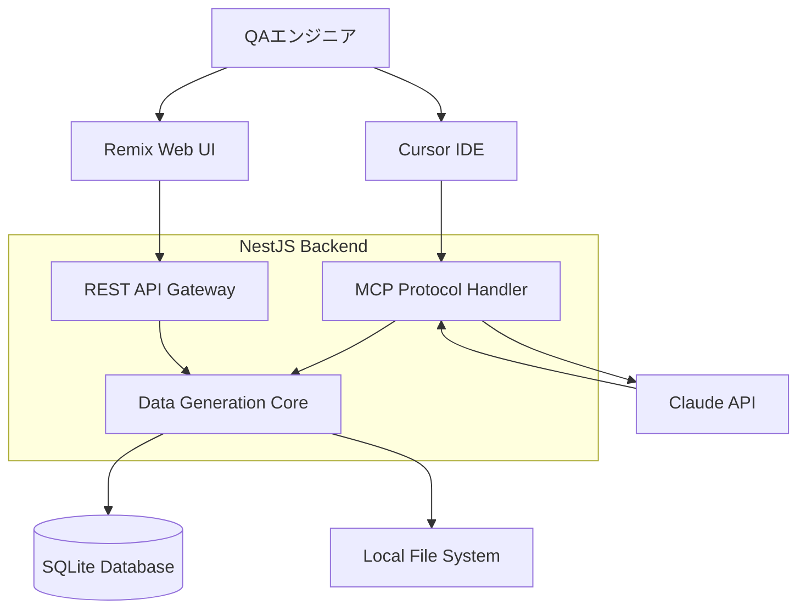

# TestData Buddy - 技術仕様書

## 🏗️ アーキテクチャ概要

### システム構成


## 📡 API仕様

### 1. パスワード生成API

#### `POST /api/generate/password`
```typescript
interface PasswordRequest {
  length: number;           // 8-128
  includeUpper: boolean;    // A-Z
  includeLower: boolean;    // a-z
  includeNumbers: boolean;  // 0-9
  includeSymbols: boolean;  // !@#$%^&*
  count?: number;          // 生成数 (default: 1)
  excludeAmbiguous?: boolean; // 紛らわしい文字除外
}

interface PasswordResponse {
  passwords: string[];
  strength: {
    score: number;      // 0-4
    feedback: string[];
  };
  metadata: {
    generatedAt: string;
    totalCount: number;
  };
}
```

### 2. ファイル生成API

#### `POST /api/generate/file`
```typescript
interface FileGenerationRequest {
  format: 'csv' | 'json' | 'xml' | 'txt' | 'pdf' | 'image';
  size?: {
    bytes?: number;     // ファイルサイズ指定
    rows?: number;      // レコード数指定
  };
  schema?: FieldSchema[];
  options?: FileOptions;
}

interface FieldSchema {
  name: string;
  type: 'string' | 'number' | 'boolean' | 'date' | 'uuid' | 'email' | 'phone' | 'address';
  constraints?: {
    min?: number;
    max?: number;
    pattern?: string;
    enum?: string[];
  };
}

interface FileGenerationResponse {
  fileId: string;
  downloadUrl: string;
  metadata: {
    filename: string;
    size: number;
    recordCount?: number;
    generatedAt: string;
  };
}
```

### 3. 個人情報生成API

#### `POST /api/generate/personal-info`
```typescript
interface PersonalInfoRequest {
  count: number;        // 生成件数
  locale: 'ja' | 'en'; // ロケール
  fields: PersonalField[];
  format: 'array' | 'csv' | 'json';
}

type PersonalField = 
  | 'fullName' | 'firstName' | 'lastName'
  | 'email' | 'phone' | 'address' | 'zipCode'
  | 'birthDate' | 'age' | 'gender'
  | 'company' | 'jobTitle';

interface PersonalInfoResponse {
  data: PersonalInfo[] | string; // array または CSV/JSON文字列
  metadata: {
    count: number;
    fields: PersonalField[];
    generatedAt: string;
  };
}
```

### 4. MCP Protocol API

#### `POST /api/mcp/execute`
```typescript
interface MCPRequest {
  action: string;       // アクション名
  parameters: any;      // アクション固有パラメータ
  context?: {
    user?: string;
    session?: string;
  };
}

interface MCPResponse {
  success: boolean;
  data?: any;
  error?: {
    code: string;
    message: string;
    details?: any;
  };
  metadata: {
    executedAt: string;
    duration: number;
  };
}
```

## 🔧 技術スタック詳細

### Backend (NestJS)

#### 依存関係
```json
{
  "dependencies": {
    "@nestjs/core": "^10.0.0",
    "@nestjs/common": "^10.0.0",
    "@nestjs/platform-express": "^10.0.0",
    "@nestjs/swagger": "^7.0.0",
    "@nestjs/typeorm": "^10.0.0",
    "typeorm": "^0.3.0",
    "sqlite3": "^5.1.0",
    "faker": "^6.6.6",
    "@faker-js/faker": "^8.0.0",
    "sharp": "^0.32.0",
    "pdfkit": "^0.13.0",
    "csv-stringify": "^6.4.0",
    "xml2js": "^0.6.0",
    "zxcvbn": "^4.4.2",
    "uuid": "^9.0.0",
    "date-fns": "^2.30.0",
    "class-validator": "^0.14.0",
    "class-transformer": "^0.5.0"
  }
}
```

#### モジュール構成
```typescript
// src/app.module.ts
@Module({
  imports: [
    TypeOrmModule.forRoot({
      type: 'sqlite',
      database: 'data/database.sqlite',
      autoLoadEntities: true,
      synchronize: true,
    }),
    PasswordModule,
    FileGenerationModule,
    PersonalInfoModule,
    MCPModule,
    ClaudeIntegrationModule,
  ],
})
export class AppModule {}
```

### Frontend (Remix)

#### 依存関係
```json
{
  "dependencies": {
    "@remix-run/node": "^2.0.0",
    "@remix-run/react": "^2.0.0",
    "@remix-run/serve": "^2.0.0",
    "react": "^18.2.0",
    "react-dom": "^18.2.0",
    "@headlessui/react": "^1.7.0",
    "@heroicons/react": "^2.0.0",
    "tailwindcss": "^3.3.0",
    "zxcvbn": "^4.4.2",
    "react-hot-toast": "^2.4.0"
  }
}
```

#### ページ構成
```
app/routes/
├── _index.tsx              # ダッシュボード
├── password.tsx            # パスワード生成
├── file-generation.tsx     # ファイル生成
├── personal-info.tsx       # 個人情報生成
├── text-generation.tsx     # テキスト生成
└── settings.tsx           # 設定
```

## 📊 データベース設計

### Entity定義

```typescript
// Generation History
@Entity()
export class GenerationHistory {
  @PrimaryGeneratedColumn()
  id: number;

  @Column()
  type: string; // 'password', 'file', 'personal_info', etc.

  @Column('text')
  parameters: string; // JSON文字列

  @Column('text', { nullable: true })
  result: string; // 生成結果のメタデータ

  @CreateDateColumn()
  createdAt: Date;

  @Column({ nullable: true })
  userId?: string;
}

// File Templates
@Entity()
export class FileTemplate {
  @PrimaryGeneratedColumn()
  id: number;

  @Column()
  name: string;

  @Column()
  type: string;

  @Column('text')
  schema: string; // JSON文字列

  @CreateDateColumn()
  createdAt: Date;

  @UpdateDateColumn()
  updatedAt: Date;
}

// User Settings
@Entity()
export class UserSettings {
  @PrimaryGeneratedColumn()
  id: number;

  @Column({ unique: true })
  userId: string;

  @Column('text')
  preferences: string; // JSON文字列

  @UpdateDateColumn()
  updatedAt: Date;
}
```

## 🤖 Claude API 連携

### プロンプト設計

#### システムプロンプト
```typescript
const SYSTEM_PROMPT = `
あなたはTestData BuddyのAIアシスタントです。
QAエンジニアのテストデータ生成要求を理解し、適切なAPIパラメータを生成してください。

利用可能なアクション:
1. generatePassword - パスワード生成
2. generateFile - ファイル生成
3. generatePersonalInfo - 個人情報生成
4. generateText - テキスト生成

レスポンスは必ずJSON形式で、以下の構造に従ってください:
{
  "action": "アクション名",
  "parameters": { /* アクション固有のパラメータ */ },
  "reasoning": "なぜこのアクションを選択したかの説明"
}
`;
```

#### 例: パスワード生成プロンプト
```typescript
const generatePasswordPrompt = (userInput: string) => `
ユーザーの要求: "${userInput}"

この要求をパスワード生成APIのパラメータに変換してください。
考慮事項:
- 文字数の指定
- 使用する文字種
- 生成数
- セキュリティ要件

JSON形式で回答してください。
`;
```

## 🛡️ セキュリティ仕様

### API認証・認可
```typescript
// JWT認証（将来実装予定）
@Injectable()
export class AuthGuard implements CanActivate {
  canActivate(context: ExecutionContext): boolean {
    // ローカル環境では認証をスキップ
    return process.env.NODE_ENV === 'development' || this.validateToken(context);
  }
}
```

### データ保護
- 生成されたファイルは24時間後に自動削除
- 個人情報は実在しない擬似データのみ
- Claude APIへの送信データにはプライバシー情報を含めない

### 入力検証
```typescript
// パスワード生成リクエストの検証
export class PasswordRequestDto {
  @IsInt()
  @Min(4)
  @Max(128)
  length: number;

  @IsBoolean()
  includeUpper: boolean;

  @IsBoolean()
  includeLower: boolean;

  @IsBoolean()
  includeNumbers: boolean;

  @IsBoolean()
  includeSymbols: boolean;

  @IsOptional()
  @IsInt()
  @Min(1)
  @Max(100)
  count?: number;
}
```

## 🔄 エラーハンドリング

### エラーレスポンス統一フォーマット
```typescript
interface ErrorResponse {
  statusCode: number;
  message: string;
  errorCode: string;
  timestamp: string;
  path: string;
  details?: any;
}

// 例
{
  "statusCode": 400,
  "message": "パスワード長は8文字以上である必要があります",
  "errorCode": "E_INVALID_PASSWORD_LENGTH",
  "timestamp": "2024-01-15T10:30:00Z",
  "path": "/api/generate/password",
  "details": {
    "minLength": 8,
    "providedLength": 4
  }
}
```

### エラーコード定義
- `E_INVALID_INPUT` - 入力値が無効
- `E_GENERATION_FAILED` - データ生成に失敗
- `E_FILE_TOO_LARGE` - ファイルサイズが上限を超過
- `E_CLAUDE_API_ERROR` - Claude API呼び出しエラー
- `E_DATABASE_ERROR` - データベースエラー

## 📈 パフォーマンス仕様

### レスポンス時間目標
- パスワード生成: < 100ms
- 小サイズファイル生成 (< 1MB): < 1秒
- 大サイズファイル生成 (< 100MB): < 30秒
- 個人情報生成 (< 1000件): < 2秒

### メモリ使用量制限
- 大容量ファイル生成時はストリーミング処理を使用
- 最大メモリ使用量: 512MB

### 同時実行制限
```typescript
@Injectable()
export class RateLimitGuard implements CanActivate {
  private readonly requests = new Map<string, number[]>();
  
  canActivate(context: ExecutionContext): boolean {
    const request = context.switchToHttp().getRequest();
    const ip = request.ip;
    
    // IP別の同時実行数制限: 5リクエスト/分
    return this.checkRateLimit(ip, 5, 60000);
  }
}
```

## 🧪 テスト仕様

### ユニットテスト
```typescript
describe('PasswordService', () => {
  it('指定された条件でパスワードを生成する', () => {
    const service = new PasswordService();
    const result = service.generate({
      length: 12,
      includeUpper: true,
      includeLower: true,
      includeNumbers: true,
      includeSymbols: false,
    });
    
    expect(result).toHaveLength(12);
    expect(result).toMatch(/^[A-Za-z0-9]+$/);
  });
});
```

### E2Eテスト
```typescript
describe('Password Generation API', () => {
  it('POST /api/generate/password', () => {
    return request(app.getHttpServer())
      .post('/api/generate/password')
      .send({
        length: 16,
        includeUpper: true,
        includeLower: true,
        includeNumbers: true,
        includeSymbols: true,
      })
      .expect(201)
      .expect((res) => {
        expect(res.body.passwords).toHaveLength(1);
        expect(res.body.passwords[0]).toHaveLength(16);
      });
  });
});
``` 